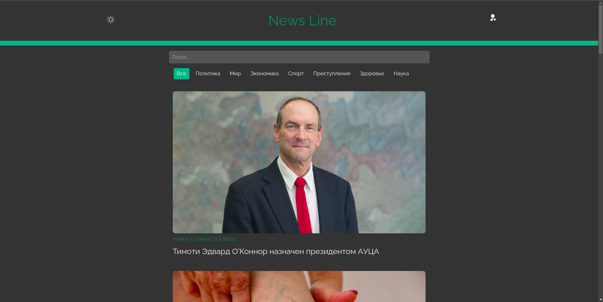

# News Line - Новостной портал на React



News Line - это современный новостной портал, предоставляющий пользователям актуальные новости со всего мира. Сайт обладает удобным интерфейсом, множеством функций, таких как поиск, фильтрация, адаптивный дизайн, уникальная Админ панель для эффективного управления контентом, комментарии для обсуждения новостей, а также система авторизации для пользователей с возможностью стандартной регистрации и аутентификации через Firebase Authentication Google.

## Особенности проекта

### 1. Новости

News Line предоставляет широкий спектр новостей по различным темам: политика, экономика, культура, наука и многое другое. Пользователи могут легко находить интересующие их материалы.

### 2. Адаптивный дизайн

Сайт обладает адаптивным дизайном, что позволяет пользователям комфортно просматривать новости на любых устройствах - от компьютера до мобильного телефона.

### 3. Поиск и фильтрация

Мощные инструменты поиска и фильтрации позволяют пользователям быстро находить нужную информацию. Фильтрация по категориям, ключевым словам и датам обеспечивает эффективный поиск.

### 4. Авторизация и Уникальная Админ панель

Для администраторов сайта предусмотрен механизм авторизации. Уникальная Админ панель обеспечивает интуитивно понятный интерфейс для управления контентом, а также другими административными функциями.

### 5. Комментарии к постам

Каждая новость предоставляет возможность для пользователей оставлять комментарии. Это способствует обсуждению и взаимодействию между читателями, позволяя им высказывать свои мнения и делиться взглядами.

### 6. Система Авторизации

Система авторизации предоставляет два способа входа:

- **Стандартная регистрация:** Пользователи могут зарегистрироваться, создав учетную запись с уникальным именем пользователя и паролем.
- **Авторизация через Firebase Authentication:** Удобная и безопасная аутентификация с использованием учетных данных Google.

## Технологии

Проект был разработан с использованием следующих технологий:

### 1. Frontend:

- **React:** JavaScript-библиотека для построения пользовательских интерфейсов.
- **Redux Toolkit:** Официальный пакет инструментов для управления состоянием приложения в React.
- **Chakra UI:** Компонентный фреймворк для React, обеспечивающий стильный и функциональный дизайн.
- **Tailwind CSS:** Удобный CSS-фреймворк для быстрой стилизации компонентов.
- **Axios:** HTTP-клиент для удобного взаимодействия с сервером.

### 2. Backend:

- **Firebase:** Облачная платформа, предоставляющая множество сервисов, таких как Firebase Authentication, Realtime Database и другие.

### 3. Другие библиотеки и инструменты:

- **Firebase Authentication:** Система аутентификации для безопасного входа пользователей.
- **React Hook Form:** Библиотека для управления формами в React.
- **React-Quill:** Реактивный текстовый редактор для ввода и редактирования контента.
- **Prettier:** Инструмент для форматирования кода, обеспечивающий единый стиль в проекте.

## Уникальные особенности

### 1. Firebase Authentication

Использование Firebase Authentication обеспечивает безопасный и удобный механизм аутентификации пользователей. Это позволяет им входить на сайт, оставлять комментарии и взаимодействовать с контентом.

### 2. React и Redux Toolkit

Применение React и Redux Toolkit обеспечивает эффективное управление состоянием приложения, обеспечивая плавный и отзывчивый интерфейс.

### 3. Chakra UI и Tailwind CSS

Использование Chakra UI и Tailwind CSS обеспечивает красивый и функциональный дизайн. Компоненты Chakra UI позволяют легко создавать стильные интерфейсы, а Tailwind CSS предоставляет гибкий подход к стилизации.

### 4. Реактивный текстовый редактор

Интеграция React-Quill обеспечивает возможность создания и редактирования контента с использованием удобного текстового редактора.

### 5. Управление формами с React Hook Form

Благодаря React Hook Form происходит удобное управление формами, что улучшает пользовательский опыт взаимодействия с веб-приложением.

## Деплой на Vercel

Проект успешно деплоился на Vercel, обеспечивая быстрый и надежный хостинг. Для развертывания на Vercel.

- Ссылка на ваш деплой: **news-portal-app-gamma.vercel.app**

## Запуск проекта

Для запуска проекта на своем компьютере выполните следующие шаги:

1. Склонируйте репозиторий на свой локальный компьютер:

   ```bash
   git clone git@github.com:myrzakan/NewsPortal.app.git

   ```

2. Перейдите в директорию проекта

   ```bash
   cd NewsLine

   ```

3. Установите зависимости:

   ```bash
   npm install или yarn install

   ```

4. Запустите проект:
   ```bash
   nmp start или yarn start
   ```
